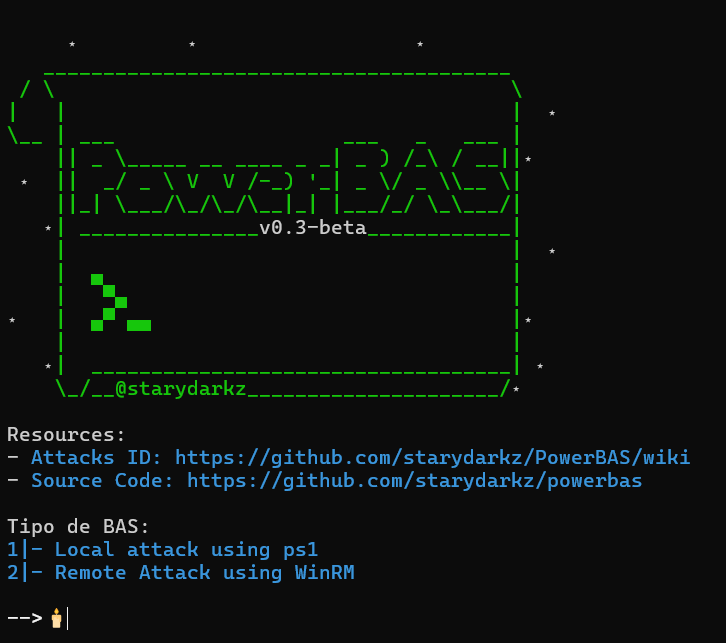

# PowerBAS

# Descripcion

PowerBAS es una herramienta de Simulacion de brecha y ataques (BAS) el cual tiene la capacidad de crear scripts de simulaciones para ser ejecutado utilizando solo powershell en equipos windows, tanto de forma local solo con un archivo .ps1 o de forma remota usando comandos remotos de powershell como base.

- **Local Attack using ps1:** Esta funcion crea un script para ser ejecutado en un equipo windows con el fin de ejecutar los ataques seleccionados, esto genera un archivo de logs con los comandos ejecutados y los resultados.
  
- **Remote Attack using winRM:** Esta funcion crea un script para ser ejecutado en un equipo windows ocn el fin de ejecutar comandos remotamente en los equipos seleccionados con los equipos seleccionado, esto genera un archivo de logs por equipos de los comandos y los resultados.

# Requisitos

- Python 3
- Librerias de python: colorama
- Powershell

